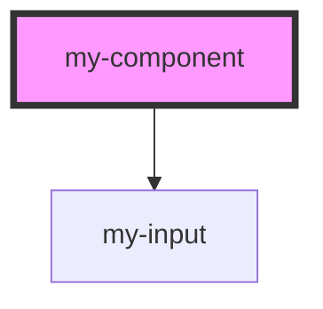

# my-component

<!-- Auto Generated Below -->

## Properties

| Property | Attribute | Description | Type     | Default   |
| -------- | --------- | ----------- | -------- | --------- |
| `hello`  | `hello`   |             | `string` | `"hello"` |

## Dependencies

### Depends on

- [my-input](../my-input)

### Graph

----------------------------------------------

*Built with [StencilJS](https://stenciljs.com/)*
